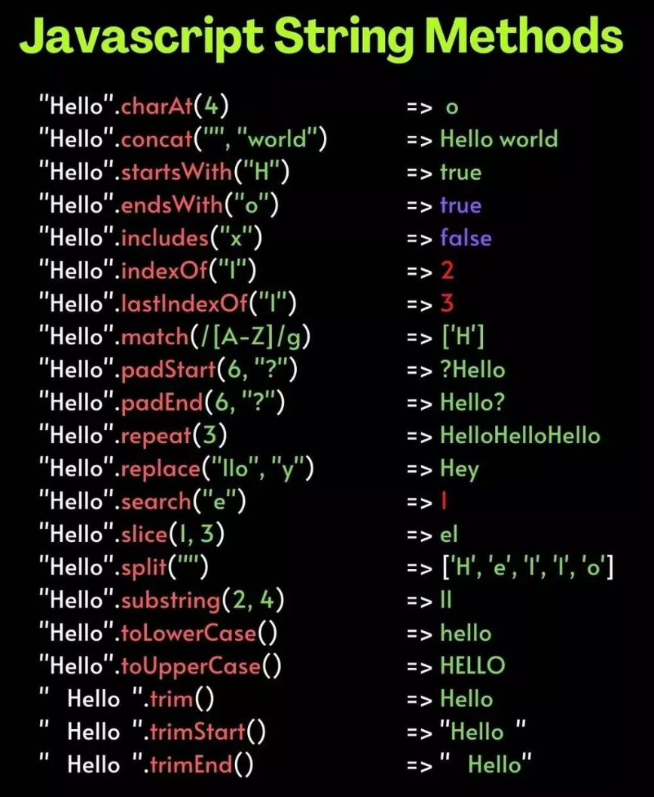
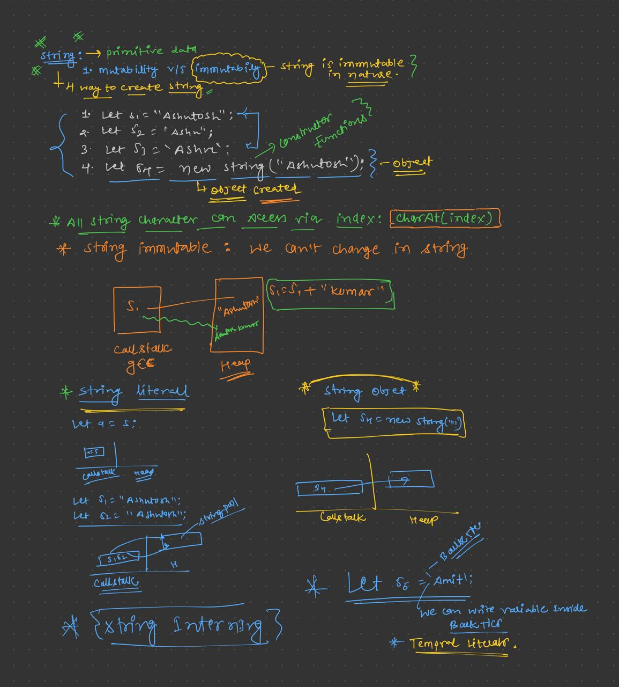

# Mastering JavaScript Strings

A comprehensive guide to JavaScript string concepts, topics, and methods with real-world React use cases.


## 🎨 String Concepts Visualization


## 📚 Resources
- [Download JavaScript Strings PDF](./resources/string%20javascript.pdf)


## Detailed Documentation
For more detailed information, check out our [readme folder](./readme/):
- [String Methods Reference](./readme/methods.md)
- [String Concepts Guide](./readme/concepts.md)

## Table of Contents

### [String Concepts](./00_concepts/)
- [What is a String?](./00_concepts/what_is_a_string.js)
- [String Creation](./00_concepts/string_creation.js)
- [Immutability](./00_concepts/immutability.js)
- [Template Literals](./00_concepts/template_literals.js)

### [String Methods](./string-methods/)
- [_01_at](./string-methods/_01_at/at.js)
- [_02_charAt](./string-methods/_02_charAt/charAt.js)
- [_03_charCodeAt](./string-methods/_03_charCodeAt/charCodeAt.js)
- [_04_codePointAt](./string-methods/_04_codePointAt/codePointAt.js)
- [_05_concat](./string-methods/_05_concat/concat.js)
- [_06_endsWith](./string-methods/_06_endsWith/endsWith.js)
- [_07_includes](./string-methods/_07_includes/includes.js)
- [_08_indexOf](./string-methods/_08_indexOf/indexOf.js)
- [_09_lastIndexOf](./string-methods/_09_lastIndexOf/lastIndexOf.js)
- [_10_localeCompare](./string-methods/_10_localeCompare/localeCompare.js)
- [_11_match](./string-methods/_11_match/match.js)
- [_12_matchAll](./string-methods/_12_matchAll/matchAll.js)
- [_13_normalize](./string-methods/_13_normalize/normalize.js)
- [_14_padEnd](./string-methods/_14_padEnd/padEnd.js)
- [_15_padStart](./string-methods/_15_padStart/padStart.js)
- [_16_repeat](./string-methods/_16_repeat/repeat.js)
- [_17_replace](./string-methods/_17_replace/replace.js)
- [_18_replaceAll](./string-methods/_18_replaceAll/replaceAll.js)
- [_19_search](./string-methods/_19_search/search.js)
- [_20_slice](./string-methods/_20_slice/slice.js)
- [_21_split](./string-methods/_21_split/split.js)
- [_22_startsWith](./string-methods/_22_startsWith/startsWith.js)
- [_23_substring](./string-methods/_23_substring/substring.js)
- [_24_toLocaleLowerCase](./string-methods/_24_toLocaleLowerCase/toLocaleLowerCase.js)
- [_25_toLocaleUpperCase](./string-methods/_25_toLocaleUpperCase/toLocaleUpperCase.js)
- [_26_toLowerCase](./string-methods/_26_toLowerCase/toLowerCase.js)
- [_27_toString](./string-methods/_27_toString/toString.js)
- [_28_toUpperCase](./string-methods/_28_toUpperCase/toUpperCase.js)
- [_29_trim](./string-methods/_29_trim/trim.js)
- [_30_trimEnd](./string-methods/_30_trimEnd/trimEnd.js)
- [_31_trimStart](./string-methods/_31_trimStart/trimStart.js)
- [_32_valueOf](./string-methods/_32_valueOf/valueOf.js)

## Folder Structure
Each method folder follows this structure:
```text
_NN_methodname/
├── methodname.js         # Explanation and basic examples
└── react-use-case/       # Real-world React application scenarios
    └── UseCase.jsx       # React component demonstrating the method
```
